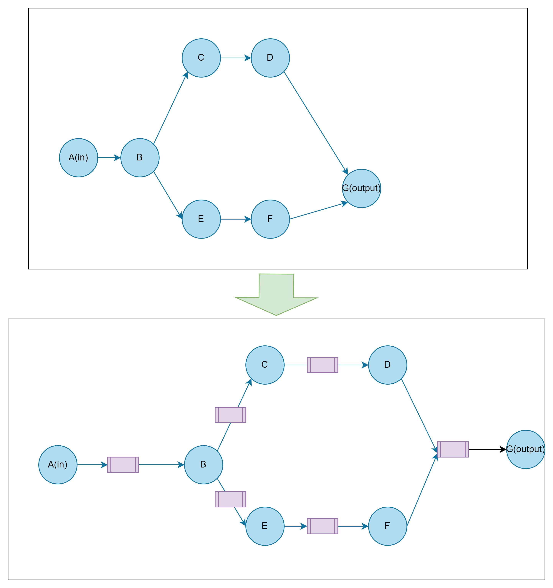

# 架构设计

jz-flow核心在于提供提供数据流功能，让数据能够沿着整个dag图谱进行流动。每当数据流过一个节点，节点根据自己的需要对数据流施加影响，改变数据的形态。每个节点可以读取流入本节点数据，处理数据，并生成新的数据输出到数据流当中。

得益于k8s强大的扩展调度能力，本项目不需要考虑复杂的部署，调度问题。而可以把重点放在图定义，节点间数据协议设计以及节点实现上。
1. dag图定义了用户镜像，命令，副本数，以及节点间前序后继的信息。 
2. 数据协议保证了数据能够安全，无损的从上有节点传递到下游节点。
3. 节点实现定义了用户节点如何于核心数据流交互。即如何从数据流中获取数据，如何讲处理的结果输入到数据流当中。

##  计算单元(ComputeUnit)

执行节点用于对数据施加某种影响，实际使用中是在k8s当中启动一个或者多个节点，这些机器同时获取数据，处理数据。
计算单元是线上尽可能的支持自定义逻辑，用户可以根据需要需要操作表格，文件，视频，模型等。同时尽量提升节点的可复用性，希望能够尽可能的增强节点的复用性，避免重复工作。

### 计算单元控制接口

1. status接口，用于或与计算单元的状态
1. start接口， 用于告知计算单元可以开始进行运算
2. pause接口， 用于告知计算单元停止计算
3. restart接口，用于告知处于暂停状态的计算单元恢复计算
4. stop接口， 用于告知计算单元当前任务已经结束

##  数据通道(DataChannel) (待定，可能会移除)

### 元数据库（MetaStore）

每个dag运行时都应当维护一个数据库，每个节点的每个批次数据都应当记录在数据库当中，数据批次经历Received, Processed, Clean的过程。在Received状态之前，前面的节点不能删除数据，在Processed之前，当前节点必须保存数据。确保数据不会因为机器物理原因丢失数据。

每次运行的数据记录在独立的库之中

1. global state 保存全局状态(grpah形态，graph 状态)
2. node state 记录每个节点的状态

### 缓存数据（tempFileStore）

持久化的缓存方式： 防止极端情况下的系统崩溃，bug导致数据丢失。包括不限文件系统，对象存储，消息队列等。
内存缓冲: 速度快，抗风险能力差

## Scheduler

支持并行dag计算。每个计算单元和数据通道通过k8s部署，计算单元和数据通道之间通过网络通信进行沟通。

scheduler根据graph从依赖图中自动插入数据通道，在从输入到输出依次部署事件单元和数据通道。准备完成后发起ready信号，整个运行图开始运转。

### 数据传输

对于数据计算单元，数据使用广播到后续的所有数据通道，保证后续节点都会处理到该数据。
对于数据通道， 数据采用扇出的方式，保证数据不会被重复处理。

### 计算节点

计算节点运行在k8s的一个pod当中，一个pod包含两个container，分别是数据容器和用户容器。

1. 数据容器用于控制数据从之前的数据通道获取数据，把数据写入到一个随机路径，然后通过ipc的方式发送信号告知用户容器有新的batch需要处理，用户容器处理完成后，回复完成信号。数据batch在进行删除缓存数据开始下一个batch。

2. 用户容器 允许用户自定义脚本。从特定位置读取数据，处理数据，并写入到指定的输出位置。

### 数据通道节点

数据通道节点采用单容器pod。订阅多个前序节点的数据输出。把数据合并成一个batch，并把数据通过扇出的方式传给后面的计算节点。

### 节点一致性协调

因为一个节点(包括计算节点和数据通道)需要支持水平扩充。因此需要维护这些pod数据的一致性。一致性的目标是：
1.可以自由伸缩，根据情况调整节点规模
2.保证输入的数据仅被处理一次，并且能成功传输给后续的节点。

## 传输协议

传输协议采用grpc，原因在于

1. 长连接，容易实现订阅事件机制
2. protobuf协议紧凑，节省流量，效率高

## 数据库

数据库采用postgres，效率良好，使用灵活。和jzfs保持一致。
元数据库采用mongo，大容量吞吐能力强，动态建表， 数据结构灵活。

## 云原生

所有组件部署在k8s集群中，每个计算节点和数据通道都是一个独立的部署单元(Deployment)，可以通过合适的编程扩充处理单元的数量。

## 日志采集及运行状态监控

通过k8s系统采集所有节点日志，搜集k8s集群搜集节点状态信息(数据吞吐量，cpu, 内存，磁盘，网络)等，最后综合显示在ui上。

## 待确认(tbd)

