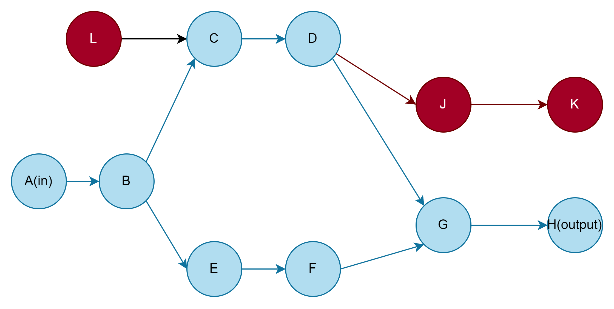

# 架构设计

##  计算单元(ComputeUnit)

执行节点用于对数据施加某种影响，实际使用中是在云组件当中启动一批机器，允许这些机器进行分布的任务处理。

### 计算单元类型

* 非阻塞单元：用于执行类似过滤这种不需要获取全部数据也能够完成的操作
* 阻塞单元： 用于执行类似排序这种需要全部数据才能进行的操作


### 计算单元事件

* 数据完成事件
* 错误事件

##  数据通道(DataChannel)

数据通道允许一些互相存直接依赖的在计算单元的数据关系构成一个数据节点。用于在这些节点管理，传输数据.

```
A ------                --------->C
        |               |
        |----->DC ------|
        |               |
B ------                --------->D
```

### 数据通道事件

上下游节点通过订阅数据通道的事件来进行数据发送或消费

* 发送数据
* 消费数据
* 数据完成事件

### 数据通道缓冲

通过缓冲来提升上下游节点的稳定性，对于阻塞形节点需要缓冲在暂时保存数据。

* 内存缓冲
* 数据库缓冲
* 消息队列缓冲

## Scheduler

支持并行dag计算。每个计算单元和数据通道通过k8s部署，计算单元和数据通道之间通过网络通信进行沟通。



scheduler根据graph从依赖图中自动插入数据通道，在从输入到输出依次部署事件单元和数据通道。准备完成后发起ready信号，整个运行图开始运转。

## 传输协议

传输协议采用grpc，原因在于

1. 长连接，容易实现订阅事件机制
2. protobuf协议紧凑，节省流量，效率高

## 数据库

数据库采用postgres，效率良好，使用灵活。和jzfs保持一致。

## 云原生

所有组件部署在k8s集群中，每个计算节点和数据通道都是一个独立的部署单元，可以通过合适的编程扩充处理单元的数量。

## 日志采集及运行状态监控

通过k8s系统采集所有节点日志，搜集k8s集群搜集节点状态信息(cpu, 内存，磁盘，网络)等，最后综合显示在ui上。