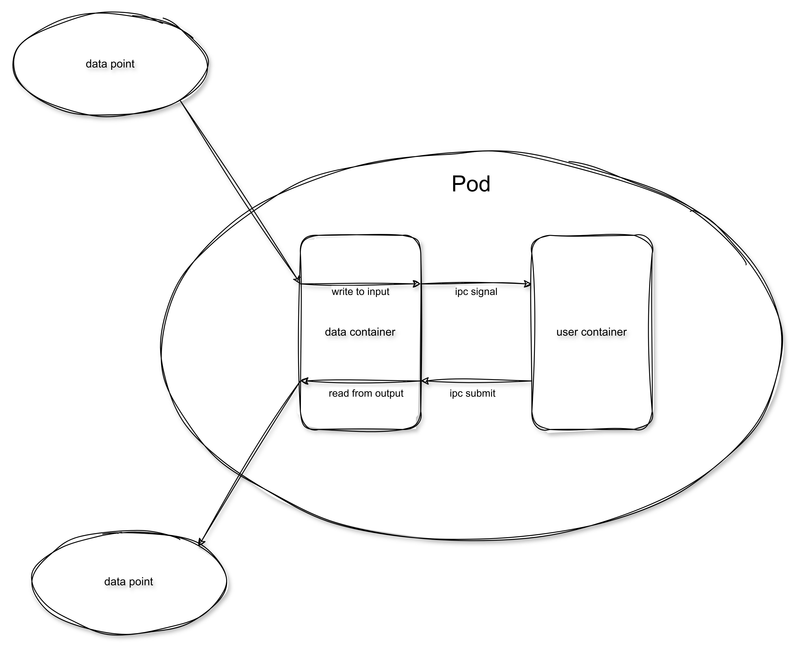

# 架构设计

##  计算单元(ComputeUnit)

执行节点用于对数据施加某种影响，实际使用中是在云组件当中启动一批机器，允许这些机器进行分布的任务处理。

### 计算单元类型

* 非阻塞单元：用于执行类似过滤这种不需要获取全部数据也能够完成的操作
* 阻塞单元： 用于执行类似排序这种需要全部数据才能进行的操作

### 计算单元接口

1. start接口， 用于告知计算单元可以开始进行运算
2. pause接口， 用于告知计算单元停止计算
3. restart接口，用于告知处于暂停状态的计算单元恢复计算
4. stop接口， 用于告知计算单元当前任务已经结束
5. ready接口， 用于前面的节点查询当前节点是否准备好接受数据，如果没准备好，需暂时停止发送数据。 

### 计算单元事件

* 数据完成事件
* 错误事件

##  数据通道(DataChannel)

数据通道允许一些互相存直接依赖的在计算单元的数据关系构成一个数据节点。用于在这些节点管理，传输数据.

```
A ------                --------->C
        |               |
        |----->DC ------|
        |               |
B ------                --------->D
```

### 数据通道接口

1. start接口， 用于告知数据通道可以开始接受数据
2. pause接口， 用于告知数据通道停止接受传输数据
3. restart接口，用于告知处于暂停状态的数据通道重新开始接受传输数据
4. stop接口， 用于告知数据通道当前任务已经结束
5. ready接口， 用于前面的节点查询当前数据通道是否准备好接受数据，如果没准备好，需暂时停止发送数据。 

### 数据通道事件

上下游节点通过订阅数据通道的事件来进行数据发送或消费

* 发送数据
* 消费数据
* 数据完成事件


通过缓冲来提升上下游节点的稳定性，对于阻塞形节点需要缓冲在暂时保存数据。

* 内存缓冲
* 数据库缓冲
* 消息队列缓冲

## 数据安全

为了确保数据的安全(每个数据被处理且仅被处理一次)。需要引入元数据库及持久化的暂存数据

### 元数据库（MetaStore）

每个dag运行时都应当维护一个数据库，每个节点的每个批次数据都应当记录在数据库当中，数据批次经历Received, Processed, Clean的过程。在Received状态之前，前面的节点不能删除数据，在Processed之前，当前节点必须保存数据。确保数据不会因为机器物理原因丢失数据。

### 持久化的暂存数据（tempFileStore）

每个节点包括计算节点和数据通道都应当采用一种持久化的数据存储方式，以防止极端情况下的系统崩溃，bug导致数据丢失。包括不限文件系统，对象存储，消息队列等。

## Scheduler

支持并行dag计算。每个计算单元和数据通道通过k8s部署，计算单元和数据通道之间通过网络通信进行沟通。


scheduler根据graph从依赖图中自动插入数据通道，在从输入到输出依次部署事件单元和数据通道。准备完成后发起ready信号，整个运行图开始运转。

### 数据传输

对于数据计算单元，数据使用广播到后续的所有数据通道，保证后续节点都会处理到该数据。
对于数据通道， 数据采用扇出的方式，保证数据不会被重复处理。

### 计算节点

计算节点运行在k8s的一个pod当中，一个pod包含两个container，分别是数据容器和用户容器。

1. 数据容器用于控制数据从之前的数据通道获取数据，把数据写入到一个随机路径，然后通过ipc的方式发送信号告知用户容器有新的batch需要处理，用户容器处理完成后，回复完成信号。数据batch在进行删除缓存数据开始下一个batch。

2. 用户容器 允许用户自定义脚本。从特定位置读取数据，处理数据，并写入到指定的输出位置。



### 数据通道节点

数据通道节点采用单容器pod。订阅多个前序节点的数据输出。把数据合并成一个batch，并把数据通过扇出的方式传给后面的计算节点。

### 节点一致性协调

因为一个节点(包括计算节点和数据通道)需要支持水平扩充。因此需要维护这些pod数据的一致性。一致性的目标是：
1.可以自由伸缩，根据情况调整节点规模
2.保证输入的数据仅被处理一次，并且能成功传输给后续的节点。

## 传输协议

传输协议采用grpc，原因在于

1. 长连接，容易实现订阅事件机制
2. protobuf协议紧凑，节省流量，效率高

## 数据库

数据库采用postgres，效率良好，使用灵活。和jzfs保持一致。
元数据库采用mongo，大容量吞吐能力强，动态建表， 数据结构灵活。

## 云原生

所有组件部署在k8s集群中，每个计算节点和数据通道都是一个独立的部署单元(Deployment)，可以通过合适的编程扩充处理单元的数量。

## 日志采集及运行状态监控

通过k8s系统采集所有节点日志，搜集k8s集群搜集节点状态信息(数据吞吐量，cpu, 内存，磁盘，网络)等，最后综合显示在ui上。

## 待确认(tbd)

